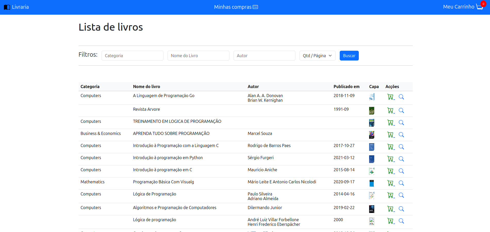

# 🌐 Django Livros Online
<div align="center">
  
</div>

<p align="center">
  <a href="https://github.com/seu-usuario/seu-repositorio">
    
  </a>
  <a href="https://github.com/guedes-jr/django_next_auth/issues">
    
  </a>
  <a href="https://github.com/guedes-jr/django_next_auth/network">
    
  </a>
  <a href="https://github.com/guedes-jr/django_next_auth/stargazers">
    
  </a>
  <a href="https://github.com/guedes-jr/django_next_auth/blob/main/LICENSE">
    
  </a>
</p>

## 📝 Sumário

- [Sobre o Projeto](#%EF%B8%8F-sobre-o-projeto)
- [Tecnologias Utilizadas](#-tecnologias-utilizadas)
- [Funcionalidades](#-funcionalidades)
- [Requisitos](#-requisitos)
- [Instalação](#-instalação)
- [Scripts Disponíveis](#-scripts-disponíveis)
- [Estrutura de Pastas](#-estrutura-de-pastas)
- [Contribuindo](#-contribuindo)
- [Licença](#-licença)
- [Contato](#-contato)

## 🛠️ Sobre o Projeto

Projeto prático realizado em processo seletivo para vaga de desenvolvedor python e Django

## 🧰 Tecnologias Utilizadas

- [Django](https://www.djangoproject.com/) - Back-end framework
- [PostgreSQL](https://www.postgresql.org/) - Banco de dados
- [Bootstrap](https://getbootstrap.com/) - Estilização

## ✨ Funcionalidades

- Listar Livros
- Detalhar Livros
- Adicionar ao carrinho
- Registrar compra
- Exportar lista de compra em PDF

## 📋 Requisitos

- Python
- Django
- PostgreSQL

## 🚀 Instalação

### Clonando o Repositório

```bash
git clone https://github.com/guedes-jr/django-livraria livraria

cd livraria
```

### Configurando o Back-end (Django)

```bash
# Criar ambiente virtual
python3 -m venv venv

# Ativar ambiente virtual
source venv/bin/activate  # No Windows use `venv\Scripts\activate`

# Instalar dependências necessárias para execução do projeto
pip install -r requirements.txt
```

### Crie um banco de dados PostgreSQL e configure o usuário e senha no arquivo `settings`
```bash
su postgres 

psql
```
```sql
create user userlivraria with password 'livraria';
create database dblivraria owner userlivraria;

\c dblivraria
create extension unaccent;
create extension pg_trgm; 
```
---
> **ERRO:** Caso ocorra erro ao fazer o migrate, verifique o status do seu postgres
> ```sudo service postgresql status```
> se estiver `down` use o seguinte comando:
> ```sudo service postgresql start```

### Criar tabelas no banco de dados e um superusuário
```bash
# Para identificar as alterações realizadas em meu user customizado
python3 manage.py makemigrations core

# Aplicar models e criar as tabelas no banco de dados
python3 manage.py migrate
```

### Executando a Aplicação

```bash
cd livraria
source venv/bin/activate  # No Windows use `venv\Scripts\activate`
python3 manage.py runserver
```

## 📁 Estrutura de Pastas

```plaintext
├── core
│   ├── admin.py
│   ├── apps.py
│   ├── constants.py
│   ├── __init__.py
│   ├── models.py
│   ├── static
│   │   └── img
│   ├── templates
│   │   ├── carrinho.html
│   │   ├── compras.html
│   │   ├── detalhar-livro.html
│   │   ├── lista-livros.html
│   │   └── relatorio-pdf.html
│   ├── templatetags
│   │   ├── filters.py
│   │   └── __init__.py
│   ├── tests.py
│   ├── urls.py
│   └── views.py
├── livraria
│   ├── asgi.py
│   ├── __init__.py
│   ├── settings.py
│   ├── urls.py
│   └── wsgi.py
├── manage.py
├── readme.md
├── requirements.txt
├── static
│   ├── css
│   │   ├── bootstrap.min.css
│   │   └── global.css
│   ├── img
│   │   ├── book-half.svg
│   │   └── demo.png
│   └── js
│       ├── bootstrap.bundle.min.js
│       ├── bootstrap.min.js
│       └── popper.min.js
└── templates
    ├── base.html
    └── base_relatorio.html
```

## 📧 Contato

👤 **João Guedes M. Jr**

- Github: [@guedes-jr](https://github.com/guedes-jr)
- LinkedIn: [João Guedes](https://www.linkedin.com/in/jo%C3%A3o-guedes-36a440135)
- Email: joao.guedes.developer@gmail.com

---

Desenvolvido com profissionalismo por [João Guedes](https://github.com/guedes-jr) 🤖.
